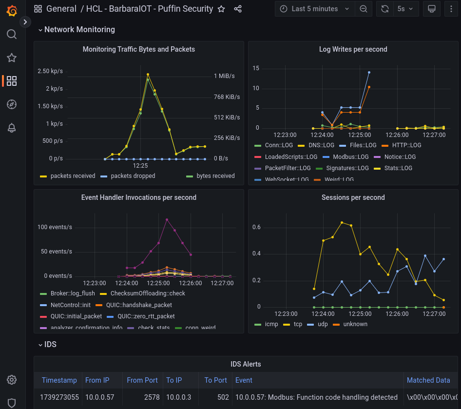

# HCL-Barbara-PuffinSecurity Traffic Analysis Demo



Based on https://github.com/zeek/zeek-demo.

This docker compose joins the [official Zeek container image](https://hub.docker.com/r/zeek/zeek-dev),
[Prometheus](https://prometheus.io/), [Loki](https://grafana.com/oss/loki/)
and [Grafana](https://grafana.com/grafana/) for demo purposes.

The setup will attach to a physical interface via AF_PACKET, as denoted by an environment variable: `ZEEK_INTERFACE`.
For demo purposes we have used both `lo` and our wifi interfaces.

The demo includes two Modbus IDS signatures that detect Function code handling, and Diagnostics devices; as well as the pcaps to trigger them. 

## Running
Clone the repository, define the interface and run docker-compose.

    $ git clone https://github.com/PuffinSecurity/BarbaraHCL-ZeekDemo
    $ cd zeek-demo
    $ export ZEEK_INTERFACE="lo"
    $ docker-compose up --build

## Service Links

After starting running `up`, the following links should be reachable on
the host system. docker-compose is setting up the necessary port forwarding.

    # Grafana (zeek:zeek as credentials)
    http://localhost:3000

    # Loki
    http://localhost:3100

    # Prometheus
    http://localhost:9090


## Launching PCAPs to trigger signatures

In order to trigger the IDS detections in the dashboard, you can run tcpreplay into the interface you are attached to.
```sh
sudo tcpreplay --intf1={{YOUR-INTERFACE}} pcaps/
```
